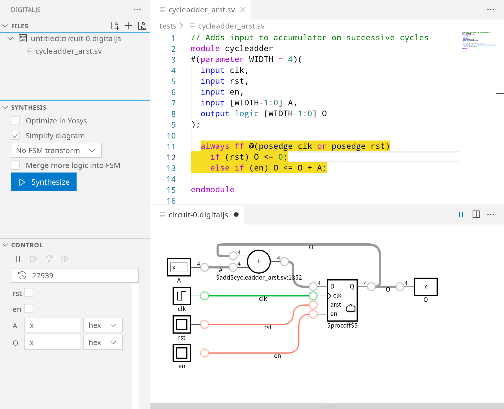

This is an extension that brings the
[DigitalJS](https://github.com/tilk/digitaljs) digital logic simulator
and the [yosys2digitaljs](https://github.com/tilk/yosys2digitaljs)
netlist format converter to VS code.
It provides similar functionalities as the [online version](https://digitaljs.tilk.eu/)
while allowing you to work directly with local source files and saving your progress,
including source information and the synthesized circuit, for future use.
It also includes other additional features like undo-redo, exporting the circuit to images
and more.

This was made possible by [DigitalJS](https://github.com/tilk/digitaljs),
[yosys2digitaljs](https://github.com/tilk/yosys2digitaljs)
and many other related projects by [Marek Materzok](http://www.tilk.eu/),
[University of Wrocław](http://www.ii.uni.wroc.pl/) as well as
the [Yosys](http://www.clifford.at/yosys/) open-source hardware synthesis framework.
This also borrows idea and code heavily from the original online version:
[DigitalJS Online](https://github.com/tilk/digitaljs_online).

Contributions are welcome!

