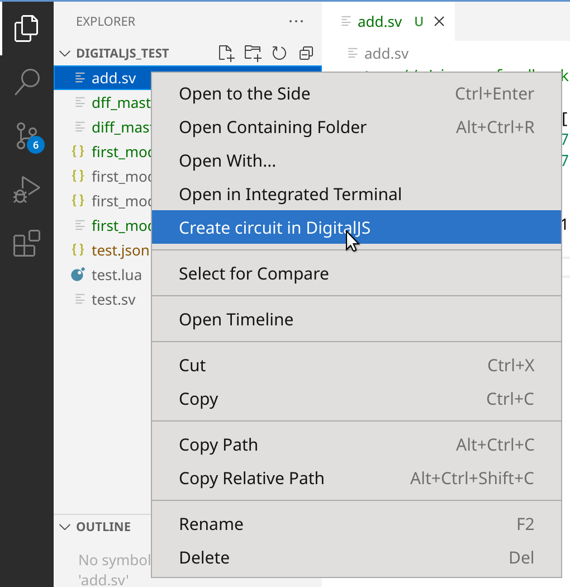

This is an extension that brings the
[DigitalJS](https://github.com/tilk/digitaljs) digital logic simulator
and the [yosys2digitaljs](https://github.com/tilk/yosys2digitaljs)
netlist format converter to VS code.
It provides similar functionalities as the [online version](https://digitaljs.tilk.eu/)
while allowing you to work directly with local source files and saving your progress,
including source information and the synthesized circuit, for future use.
It also includes other additional features like undo-redo, exporting the circuit to images
and more.

This was made possible by [DigitalJS](https://github.com/tilk/digitaljs),
[yosys2digitaljs](https://github.com/tilk/yosys2digitaljs)
and many other related projects by [Marek Materzok](http://www.tilk.eu/),
[University of Wrocław](http://www.ii.uni.wroc.pl/) as well as
the [Yosys](https://yosyshq.net/yosys/) open-source hardware synthesis framework.
This also borrows idea and code heavily from the original online version:
[DigitalJS Online](https://github.com/tilk/digitaljs_online).

Contributions are welcome!

# Features

* Simulation of circuit (using [DigitalJS](https://github.com/tilk/digitaljs)) including support for

    * Continuous simulation
    * Single step
    * Trigger
    * Signal monitor and plotting.

* __Saving/backing up__ the circuit including the source file information in a portable format

  (The relative paths of the source files are saved and so that the project can be fully
   restored on another machine as long as the source files are also packaged/copied with
   the project/circuit file)

  The saved file can be loaded again using this extension,
  or in the [online version](https://digitaljs.tilk.eu/) for simulation.

* Open the JSON circuit saved by the [online version](https://digitaljs.tilk.eu/)
  for simulation. Accepted extensions are either `.json` or `.digitaljs`.
  `.digitaljs` will be openned by default using this extension.

* __Exporting the synthesized circuit as vector (SVG) or raster images (PNG or JPEG)__.

* __Undo and redo__ all the changes on the circuit including but not limited to
  resynthesize of the circuit and edits done from the graphic view of the circuit.

* __Highlighting the source code__ that matches certain circuit element in the graphic view.

    This can be seen in the screenshot above.

* Using `Lua` scripts to customize/seed the simulation
  (using [`digitaljs_lua`](https://github.com/tilk/digitaljs_lua))

* Lua command line

* Viewing and simulation multiple circuits simultaneously

* Zoom and pan support with both mouse and touch screen.

* Can run either fully locally using the native version of VS Code,
  or fully on the web using the web version of VS Code
  (e.g. [vscode.dev](https://vscode.dev/), [github.dev](https://github.dev/) or [gitpod.io](https://gitpod.io/))

# Basic workflow

* Creating and opening circuit

    New circuits can be created from as empty circuit or from existing source files.

    * To create a new circuit, using the `DigitalJS: New Circuit` command
      or clicking the DigitalJS icon next to the editor title when the current source file
      isn't one recognized by DigitalJS.
    * To create a circuit from an existing source file (`.v`, `.sv`, `.vh` and `.lua` supported)
      Use the DigitalJS icon when the source file is open or click `Create circuit in DigitalJS`
      in the context menu for the file in the explorer view.

      

    After the circuit is created, new files can be added to it either using the DigitalJS icon
    and the explorer context menu, or using the `Add Files` button from the `Files` view
    in the DigitalJS side panel.

    Files with extension `.digitaljs` will automatically be opened by the DigitalJS extension.
    Opening files with `.json` is also supported using either explorer context menu
    or `Open With` vscode command. One can also open the JSON files saved from
    [DigitalJS Online](https://digitaljs.tilk.eu/). However, since DigitalJS Online
    does not save any source info, only simulation and graphic editor is supported
    on such files. Synthesis is only supported once new source files has been added.

    Note that the circuit file contains relative path to the source files.
    If the circuit is to be copied to a different machine, the source files
    also need to be copied with the same relative paths.

* The main UI for the DigitalJS extension includes the main circuit view/editor
  and three side panels.

    The main circuit view shows the synthesized circuit (if one exists).
    It includes interactive tools to view the circuit, edit connection,
    view and plot signal and trigger setup.
    The circuit view support zooming and panning using touch/drag, two-finger drag/pinch
    as well as Ctrl-key + scroll wheel.
    For complex circuit, the submodules in the circuit can be opened
    in a popup window.

    The three side panels shows the files in the circuit, the sythesis options
    and simulation control respectively.

* Synthesis

    Once the source files are added, the circuit can be synthesized
    using the synthesis side panel. The synthesis options can be set on the same panel
    and will be saved alone with the circuit.

    If the source file for the circuit is visible in an text editor,
    hovering the wires and devices on the main circuit view will highlight
    the corresponding lines of code in the source editor.

* Simulation

    The wires in the main circuit view are highlighted according to the simulation status
    and one can also hover on the wires to see the signal values.
    The input values for the toplevel module can be changed interactively in the circuit.
    The input and output port can also be seen/controlled in the control side panel.

    To start/pause the simulation, one can use the play/pause icon next to the editor title.
    For more complex simulation control including fast-forward, single-step,
    or wait for event, a more complete set of buttons are available in the control panel.
    The simulation time tick is also shown in the control panel.

    The magnifying glass icon on the wires allow one to monitor a signal
    and create a plot for it. Clicking the icon brings up the monitor view
    as part of the main circuit view. One can also setup triggering condition
    in the monitor view.

* Saving progress

    The main circuit view is implemented as a custom editor and all the normal saving/restoring
    operation on an editor is supported using the corresponding hotkey or menu from vscode.
    This includes, saving, saving as, reverting, undo and redo.
    Note that changes to the circuit layout from the graphic interface is saved
    and will be part of the undo/redo history.
    However, the signals in the circuit is not saved.
    Note that due to the limit of vscode, saving the circuit as a different name
    will close the circuit and open it under new name and the simulation status will be lost.

* Exporting image

    The circuit, including the signal levels can be exported as either vector or scalar images.
    SVG, PNG and JPEG formats are supported and additional format may also be available
    depending on the host browser.

    The exported image is for a single circuit view.
    Images for the subcircuits needs to be exported individually.
    Note that export of subcircuit image requires the corresponding subcircuit to be open.

* Lua scripting

    For more complex control of the simulation, one can use `lua` script.

    To run a script, one need to add the script as a source file to the circuit and use the
    run button in the digitaljs files view to start the script. The run button will be changed
    into a stop button to abort the script when the script is running.
    In addition to the API at https://github.com/tilk/digitaljs_lua/blob/master/docs/USAGE.md
    two additional functions `sim.start()` and `sim.stop(synchronize=false)` are also supported
    to start and stop the simulation.

    By default, the output of the script will be shown as notification messages in vscode.
    Alternatively, one can open a Lua terminal for the circuit using the `Lua Terminal` button
    in the DigitalJS files panel. When the terminal is visible, the output of the script
    will be printed to the terminal instead. One can also use the terminal to interactively
    run lua script similar to the normal Lua command line interface. Command line editing
    and command line history are supported. Pressing `Ctrl-C` in the command line abort
    the execution of the commands from the command line.
    (It does not stop the execution of other lua scripts).
